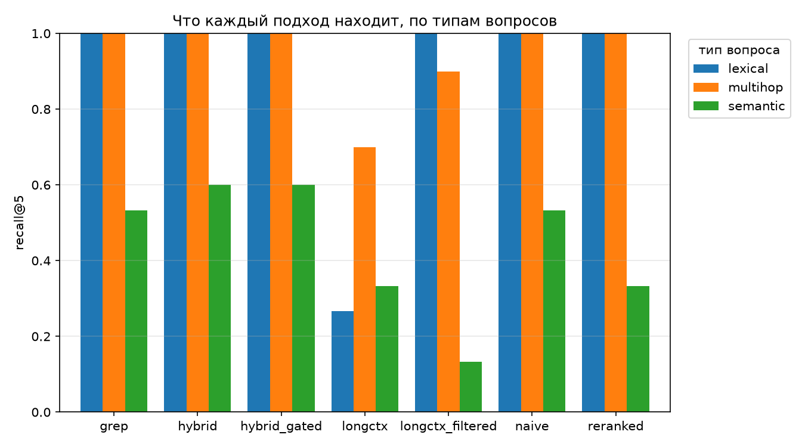
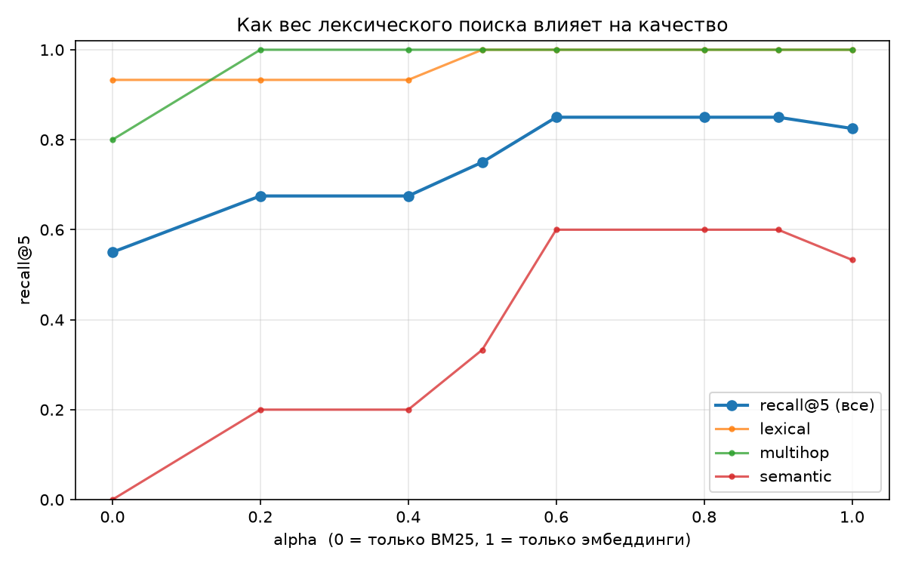

# rag-bench

Сравнение семи подходов к поиску по документации на одном корпусе,
одном наборе размеченных вопросов и одном промпте генерации.

**Вопрос работы:** стоит ли строить векторный RAG на корпусе размера
~190k токенов — или достаточно поиска по словам? И как на этот выбор
влияет то, какими словами пользователи формулируют вопросы?

---

## Три вывода

**1. Универсального победителя нет, всё решает тип вопроса.**
Чистый BM25 находит нужный документ в 93% лексических вопросов —
и в **0%** семантических. Ровно ноль из пятнадцати. Чистые эмбеддинги
дают 53% на семантике, но проигрывают на точных идентификаторах.
Выбор подхода имеет смысл только после того, как известно, как
формулируют вопросы реальные пользователи.

**2. Лексический поиск полезен как добавка и вреден как равный партнёр.**
При весе векторов 0.8 гибрид даёт recall 0.85 и MRR 0.715. При 0.5 —
0.75 и 0.640, то есть хуже чистых векторов. Между 0.6 и 0.9 держится
плато, оптимум не острый. Настройка одного этого параметра дала +10
пунктов recall — больше, чем всё остальное в проекте вместе взятое.

**3. Узкое место — не поиск и не галлюцинации, а осторожность генератора.**
Из 92 неверных ответов **70 (76%) — это отказ «NO DATA», а не выдумка**.
Причём система отказывается, имея нужный документ на руках: у `naive`
это 18% таких случаев, у `reranked` 20%, у `hybrid_gated` 26%. Подходы,
отправляющие в промпт много контекста, не отказались **ни разу**.
Чем меньше фрагментов, тем чаще модель предпочитает промолчать.
Лечится это промптом и размером выдачи, а не заменой ретривера.

**Отдельно: механизм принудительного отказа оказался вреден.**
Идея была хороша — cross-encoder даёт абсолютную оценку релевантности,
а значит умеет отличать «ответа нет» от «ответ есть», чего косинус
не умеет. По retrieval-метрикам `hybrid_gated` выигрывал у всех.
Но на реальных ответах он проиграл простому гибриду: 0.60 против 0.70
правильных ответов и 0.70 против 0.84 корректных отказов. Порог глушил
ответы там, где документ был найден. Собственное «не знаю» модели
на этом корпусе работает лучше нашего откалиброванного порога.

---

## Как меряли

**Корпус.** Документация FastAPI: 153 markdown-файла, ~1.1 МБ,
около 190 000 токенов, 1554 чанка при нарезке по заголовкам.
Исключены `release-notes.md` (700 КБ, почти половина объёма, полезных
ответов почти нет) и служебный `_llm-test.md`.

Особенность корпуса: код примеров вынесен во внешние файлы, в markdown
стоит только ссылка вида `{* ../../docs_src/... *}`. Поэтому эталонные
ответы сформулированы на уровне понятий и названий параметров,
а не точного синтаксиса — иначе система штрафовалась бы за отсутствие
того, чего в корпусе физически нет.

**Вопросы.** 50 штук, размечены по типам:

| Тип | Сколько | Что проверяет |
|---|---|---|
| `lexical` | 15 | поиск по точным словам |
| `semantic` | 15 | понимание смысла без совпадения слов |
| `multihop` | 10 | сбор ответа из нескольких файлов |
| `unanswerable` | 10 | честный отказ вместо выдумки |

Вопросы на английском — на языке корпуса. Русские вопросы ломали бы
измерение дважды: BM25 никогда не совпал бы с английским текстом,
а `all-MiniLM-L6-v2` — англоязычная модель, и мерились бы её
кросс-язычные способности, а не качество подходов.

Семантические вопросы проверены не на глаз, а измерением:
`scripts/02_check_questions.py` запускает по каждому BM25 и убеждается,
что словарный поиск **не** находит нужный документ в топ-3. Шесть
из пятнадцати черновиков эту проверку не прошли и были переформулированы.

**Метрики.** Поиск и генерация меряются раздельно — иначе при плохом
результате непонятно, что чинить.

- `recall@5` — попал ли нужный файл в первую пятёрку
- `precision@5` — какая доля выданного действительно нужна
- `MRR` — насколько высоко оказался нужный документ
- `abstain_ok` — правильно ли система молчит

---

## Результаты

Нарезка по заголовкам, `HYBRID_ALPHA = 0.8`, 50 вопросов,
генерация и оценка через `gpt-4o-mini`.

| Подход | recall@5 | precision | MRR | док. в промпт | correct | abstain_ok | латентность, с | $/1000 запросов |
|---|---|---|---|---|---|---|---|---|
| `hybrid` | **0.850** | 0.407 | **0.715** | 3.36 | **0.700** | 0.840 | 0.012 | 0.13 |
| `hybrid_gated` | **0.850** | 0.407 | **0.715** | 3.36 | 0.600 | 0.700 | 0.077 | 0.09 |
| `naive` | 0.825 | **0.410** | 0.622 | 3.36 | 0.625 | 0.760 | 0.008 | 0.12 |
| `grep` | 0.825 | 0.338 | 0.615 | 3.42 | 0.675 | **0.880** | 3.375 | 0.62 |
| `reranked` | 0.750 | 0.340 | 0.640 | 3.58 | 0.600 | 0.680 | 0.303 | 0.09 |
| `longctx_filtered` | 0.650 | 0.103 | 0.568 | 8.00 | **0.750** | 0.840 | 0.005 | 3.22 |
| `longctx` | 0.400 | 0.005 | 0.031 | 103 | **0.750** | **0.900** | 0.000 | 18.55 |

`longctx` показателен парой recall и precision: 0.40 против 0.005.
Он «находит» ответ ровно в том смысле, в каком его находит человек,
которому выдали библиотеку целиком. При этом корпус в окно не влезает —
в бюджет 100k токенов попадает 103 чанка из 1554.

### Почему колонку `correct` нельзя читать напрямую

На первый взгляд таблица выглядит парадоксально: худший по поиску подход
(`longctx`, recall 0.40) даёт лучшие ответы (0.75). Кажется, что качество
поиска на качество ответа не влияет.

Это иллюзия, и разбирается она одним разрезом — по тому, был ли нужный
документ в выдаче.

**Когда документ НЕ найден (recall = 0):**

| Подход | верных ответов |
|---|---|
| `naive` | 0 из 7 |
| `hybrid` | 0 из 6 |
| `hybrid_gated` | 0 из 6 |
| `reranked` | 0 из 10 |
| `grep` | 2 из 7 |
| `longctx_filtered` | 5 из 14 |
| `longctx` | 16 из 24 |

**Когда документ найден (recall = 1):**

| Подход | верных ответов |
|---|---|
| `longctx_filtered` | 96% |
| `longctx` | 88% |
| `hybrid` | 82% |
| `reranked` | 80% |
| `naive` | 76% |
| `grep` | 76% |
| `hybrid_gated` | 71% |

У четырёх чанковых подходов — **ровно ноль верных ответов из двадцати
девяти при проваленном поиске**. Не нашёл документ — не ответил, без единого
исключения. Основное допущение RAG выполняется в чистом виде.

Весь «выигрыш» `longctx` набран на вопросах, где эталонного документа
в выдаче не было. Причина не в том, что модель помнит FastAPI, — при
разборе вручную видно другое: она отвечает по **другому** файлу корпуса,
где та же тема тоже описана. В `gold_sources` указан один канонический
файл, а документация повторяет понятия в нескольких разделах.

Отсюда правило чтения: **агрегированный `correct` смешивает качество ответа
с объёмом отправленного контекста**. Сравнивать подходы нужно по условной
точности, и по ней порядок обычный.

### Три четверти ошибок — это молчание

```
Всего вердиктов НЕВЕРНО: 92
  отказ «NO DATA»:       70  (76%)
  неверный ответ:        22  (24%)
```

Причём отказы происходят при найденном документе:

| Подход | отказался, имея нужный документ |
|---|---|
| `hybrid_gated` | 26% |
| `reranked` | 20% |
| `naive` | 18% |
| `hybrid` | 9% |
| `grep` | 6% |
| `longctx`, `longctx_filtered` | **0%** |

Зависимость от объёма контекста прямая: чем меньше фрагментов в промпте,
тем осторожнее модель. Подходы, отправляющие десятки документов,
не отказались ни разу.

Практический вывод: на этом корпусе система теряет ответы не из-за поиска
и не из-за выдумок, а из-за собственной осторожности. Дешёвые способы
проверить это дальше — поднять `TOP_K` с 5 до 8–10 и смягчить инструкцию
об отказе в промпте. Ни то, ни другое не требует менять ретривер.

### Recall@5 по типам вопросов

Главный результат работы.



Синие и оранжевые столбики почти везде упираются в потолок. Различаются
подходы только зелёными — то есть вся разница между ними определяется
семантическими вопросами.

| Подход | lexical | multihop | semantic |
|---|---|---|---|
| `hybrid_gated` | 1.000 | 1.000 | **0.600** |
| `hybrid` | 1.000 | 1.000 | **0.600** |
| `naive` | 1.000 | 1.000 | 0.533 |
| `reranked` | 1.000 | 1.000 | 0.333 |
| `longctx_filtered` | 1.000 | 0.900 | 0.133 |
| `longctx` | 0.267 | 0.700 | 0.333 |

Все различия между подходами сосредоточены в одной колонке. На лексических
и многошаговых вопросах у векторных подходов потолок, разъезжаются они
только на семантике.

Потолок на семантических вопросах — **0.6**. Даже лучший подход находит
нужный документ по смыслу примерно в трёх случаях из пяти. Это самая
честная строчка во всей работе.

`longctx_filtered` — крайний случай: лексический фильтр даёт идеальную
единицу на `lexical` и 0.133 на `semantic`.

---

## Вес лексического поиска

`scripts/04_sweep_alpha.py`, 40 вопросов с источниками.
alpha — доля веса, уходящая векторам: 1.0 только эмбеддинги, 0.0 только BM25.

| alpha | recall@5 | precision | MRR | lexical | multihop | semantic |
|---|---|---|---|---|---|---|
| 0.0 | 0.550 | 0.250 | 0.460 | 0.933 | 0.800 | **0.000** |
| 0.2 | 0.675 | 0.324 | 0.554 | 0.933 | 1.000 | 0.200 |
| 0.4 | 0.675 | 0.330 | 0.592 | 0.933 | 1.000 | 0.200 |
| 0.5 | 0.750 | 0.346 | 0.640 | 1.000 | 1.000 | 0.333 |
| 0.6 | 0.850 | 0.407 | 0.673 | 1.000 | 1.000 | 0.600 |
| **0.8** | **0.850** | 0.407 | **0.715** | 1.000 | 1.000 | 0.600 |
| 0.9 | 0.850 | 0.402 | 0.698 | 1.000 | 1.000 | 0.600 |
| 1.0 | 0.825 | 0.410 | 0.622 | 1.000 | 1.000 | 0.533 |



Три наблюдения.

**Нулевая семантика при alpha = 0.** Ни один из пятнадцати семантических
вопросов не находится словарным поиском. Это подтверждает не только вывод,
но и корректность набора вопросов: в них действительно нет лексических
зацепок.

**Плато 0.6–0.9.** Параметр не острый, промахнуться трудно.

**Немного лексики полезно.** От 1.0 к 0.8 recall растёт с 0.825 до 0.85,
MRR — с 0.622 до 0.715. Дальше вниз всё рушится.

Проверка корректности: при alpha = 1.0 цифры совпадают с подходом `naive`.

---

## Механизм честного отказа

Retrieval всегда что-то возвращает: ближайшие соседи существуют и тогда,
когда в корпусе нет ничего подходящего. Модель получает пять правдоподобных
фрагментов и сочиняет по ним ответ.

Косинус тут не помогает — величина относительная. Cross-encoder даёт
абсолютную оценку, которую можно сравнить с порогом.

### Почему первая попытка показала, что механизм бесполезен

`scripts/03_calibrate_threshold.py` считает точность решения «отвечать
или молчать» и выдаёт: лучший порог −9.18, точность 80%. Проблема в том,
что стратегия «никогда не молчать» даёт ровно те же 80% — отвечаемых
вопросов вчетверо больше, и accuracy вознаграждает большинство.

Кроме того, отказ на вопросе, где ретривер **сам ничего не нашёл**,
считался там ошибкой. Хотя отвечать в этом случае всё равно нечем,
и молчание спасает от выдумки.

### Разбор по трём категориям

`scripts/05_analyze_abstention.py --method hybrid_gated`.
Из 50 вопросов: 10 неотвечаемых, 34 с найденным документом, 6 промахов.

| порог | оправдан | полезен | ВРЕДЕН | выдумок пропущено |
|---|---|---|---|---|
| −5.0 | 6/10 | 2/6 | 6/34 | 4 |
| −4.0 | 8/10 | 2/6 | 6/34 | 2 |
| **−3.0** | **9/10** | **3/6** | **6/34** | **1** |
| −2.0 | 9/10 | 3/6 | 7/34 | 1 |
| 0.0 | 9/10 | 5/6 | 9/34 | 1 |
| 1.0 | 9/10 | 6/6 | 13/34 | 1 |

Порог −3.0 недоминируем: тот же вред, что у −4.0, но больше пользы.

Механизм работает. Он не был сломан — была сломана метрика.

### Выбор порога — решение продуктовое, а не техническое

Что дороже: промолчать зря или ответить выдумкой? В справочнике по
библиотеке лишнее «не знаю» стоит недорого, а выдуманный API дорого,
поэтому здесь оправдан агрессивный порог. В сервисе, где пользователь
уходит после первого отказа, выбор был бы другим.

Пороги у подходов **разные** и хранятся раздельно: оценка берётся как
максимум по отобранным кандидатам, а `reranked` смотрит на 20 штук
против 5 у `hybrid_gated`. Максимум по двадцати систематически выше.

### Прямое сравнение двух подходов

`reranked` при пороге 0.0 — 26 вопросов отвечены с нужным документом,
поймано 8 из 10 выдумок.
`hybrid_gated` при пороге −3.0 — **28** вопросов отвечены,
поймано **9** из 10 выдумок.

По retrieval-метрикам это лучше по обеим осям сразу, что для такого
обмена нетипично.

### Но на реальных ответах механизм проиграл

Всё вышеописанное меряет поиск. Когда добавилась генерация, картина
перевернулась:

| | `hybrid` (порога нет) | `hybrid_gated` (порог −3.0) |
|---|---|---|
| правильных ответов | **0.70** | 0.60 |
| корректных отказов | **0.84** | 0.70 |
| отказ при найденном документе | 9% | **26%** |

Порог отказывался ровно там, где документ был на руках. Собственное
«NO DATA» модели, без всякого cross-encoder, оказалось и точнее,
и полезнее нашего откалиброванного порога.

Причина, скорее всего, в том, что порог калибровался по метрике
«есть ли эталонный документ в выдаче», а модели для ответа хватает
и неэталонного файла с той же темой. Мы оптимизировали не то,
что нужно было оптимизировать.

Это главный отрицательный результат работы, и он же самый поучительный:
механизм, безупречный по промежуточной метрике, ухудшил конечную.
Промежуточные метрики удобны тем, что бесплатны, и опасны ровно этим же.

---

## Чанкование: по заголовкам против по символам

`markdown` — нарезка по заголовкам с сохранением пути
(`Request Body > Create your data model`), 1554 чанка, средняя длина 449.
`chars` — наивная нарезка по 800 символов с нахлёстом, 1238 чанков,
средняя длина 741.

| Подход | recall md | recall chars | MRR md | MRR chars | semantic md | semantic chars |
|---|---|---|---|---|---|---|
| `hybrid_gated` | **0.850** | 0.825 | **0.715** | 0.656 | **0.600** | 0.533 |
| `naive` | **0.825** | 0.775 | 0.622 | 0.625 | **0.533** | 0.467 |
| `reranked` | 0.750 | **0.800** | 0.640 | 0.638 | 0.333 | **0.533** |
| `longctx` | **0.400** | 0.300 | 0.031 | 0.031 | **0.333** | 0.267 |

Нарезка по заголовкам лучше, но выигрыш умеренный: +2.5 пункта recall,
+9% MRR, +12.5% на семантике.

**И это неожиданный результат.** Настройка веса поиска дала +10 пунктов
recall, чанкование — +2.5. То есть на этом корпусе выбор параметра
поиска оказался важнее способа нарезки, хотя обычно советуют обратное.

Правдоподобное объяснение: документация FastAPI и так состоит из коротких
разделов, и наивная нарезка редко разрывает смысловую единицу. На корпусе
из длинных сплошных документов разрыв был бы больше. Вывод не переносится
на другие типы текстов.

Отдельно: MRR растёт заметнее, чем recall. Оба варианта находят документ
примерно одинаково часто, но с путём заголовков он оказывается выше
в выдаче — прямой эффект приписки `[section: ...]` к тексту чанка.

`reranked` — единственное исключение, на `chars` он лучше.
Объяснения этому у нас нет.

---

## Проверка LLM-судьи

Колонка `correct` проставлена языковой моделью, и доверять ей без проверки
нельзя. Проверка сделана в два шага.

**Шаг 1.** Из 350 вердиктов отобраны 20 — стратифицированно, чтобы попали
все четыре сочетания «верно/неверно» с «документ найден/не найден».
Их независимо оценила вторая модель.

**Шаг 2.** Случаи, где две модели разошлись или где ответ выглядел спорным,
разобраны **вручную автором работы**.

**Результат: совпадение 17 из 20, то есть 85%.**

Все три расхождения — на расплывчатых ответах, и они разнонаправленные:
дважды судья оказался мягче человека, один раз строже. Систематического
перекоса нет, поэтому цифры `correct` пригодны для сравнения подходов
между собой, но не как абсолютная оценка качества.

Полезнее самой цифры оказался **характер** судьи. Он засчитывает верным
ответ, который называет правильное направление, но отсылает читателя
в документацию вместо ответа — например: «используйте фоновые задачи,
подробности см. в документации». Человек такой ответ не принял.
Если бы судья был строже к отсылкам, `correct` у всех подходов
оказался бы ниже, а разрывы между ними — примерно теми же.

Материалы проверки: `judge_check.md`.

### Побочная находка: выдуманные ссылки

В одном из проверенных ответов модель верно объяснила `response_model`
и сослалась на `advanced__response-model.md` — **файла с таким именем
в корпусе нет** (настоящий называется `tutorial__response-model.md`).

Инструкция «укажи источники» создаёт видимость обоснованности, которую
никто не проверяет. Если ссылки показываются пользователю, их нужно
валидировать по списку реальных файлов — это две строки кода
и заметная разница в доверии.

---

## Ограничения

Раздел важнее результатов: он показывает, чему в этих цифрах верить.

**Разметка `gold_sources` строже, чем реальность.** Для каждого вопроса
указан один канонический файл, но документация FastAPI описывает многие
темы в нескольких местах. Поэтому `recall` систематически занижен для
подходов, отправляющих много документов, и именно этим объясняется
их завышенный `correct`. Честное измерение потребовало бы размечать
все файлы, где ответ присутствует, — это заметно больше ручной работы.

**Судья проверен на 20 вердиктах из 350.** Совпадение 85%. Выборка мала,
и на другой двадцатке цифра могла бы отличаться на несколько пунктов.

**Модель могла видеть этот корпус при обучении.** Документация FastAPI
публична и популярна. Прямых свидетельств ответа «по памяти» при разборе
не нашлось, но исключить это нельзя. Чистый эксперимент требует
закрытого корпуса.

**50 вопросов — мало.** Разница в 2–3 пункта на такой выборке неотличима
от шума. Уверенно можно говорить только о крупных разрывах: ноль против
0.6 на семантике, 0.005 против 0.4 у precision long-context.

**Часть вопросов сгенерирована** и проверена вручную. Сгенерированные
вопросы наследуют лексику документации, и это смещение работает в пользу
лексического поиска. Семантические вопросы писались отдельно и проходили
проверку через BM25.

**Один корпус, один домен, один язык, одна модель эмбеддингов, одна
модель генерации.** `all-MiniLM-L6-v2` — маленькая и старая модель;
более сильная сдвинула бы результаты `naive` и `hybrid`, и неизвестно
насколько. Выводы не переносятся автоматически на другие корпуса.

**Время индексации замерено неаккуратно.** В колонке `build_s` смешаны
прогоны с холодным и тёплым кэшем эмбеддингов, поэтому цифры там
несравнимы между подходами.

**Порог отказа калиброван по неправильной цели.** Он подбирался так,
чтобы система молчала, когда в выдаче нет эталонного документа. Но модели
для верного ответа хватает и неэталонного файла с той же темой — поэтому
оптимальный по калибровке порог ухудшил конечное качество. Правильнее
было бы калибровать прямо по `correct`, но это требует платного прогона
на каждое значение порога.

**Кросс-язычный поиск не исследован.** Вопросы на языке, отличном
от языка корпуса, — отдельный эксперимент, где меряется мультиязычность
эмбеддингов, а не качество подходов.

---

## Как воспроизвести

```bash
python -m venv .venv
source .venv/bin/activate          # Windows: .venv\Scripts\activate
pip install -r requirements.txt

python scripts/01_download_corpus.py     # корпус
python scripts/02_check_questions.py     # проверка разметки

python eval/run_eval.py --retrieval-only          # основная таблица
python scripts/04_sweep_alpha.py                  # кривая по alpha
python scripts/05_analyze_abstention.py --method hybrid_gated
```

Всё перечисленное работает без API-ключа и не тратит денег: метрики
поиска считаются локально, эмбеддинги и cross-encoder — тоже.
Ключ нужен только для генерации ответов и LLM-судьи.

Устройство проекта и обоснование решений, включая неудачные —
[EXPLAINED.md](EXPLAINED.md).
Разбор вердиктов LLM-судьи — [judge_check.md](judge_check.md).

---

## Что сравнивается

| Подход | Индекс | Поиск | Векторы |
|---|---|---|---|
| `naive` | эмбеддинги всех чанков | ближайшие соседи | да |
| `hybrid` | эмбеддинги + BM25 | слияние через RRF с весом alpha | да |
| `reranked` | то же + cross-encoder | 20 кандидатов → пересортировка → 5 | да |
| `hybrid_gated` | то же | порядок от гибрида, cross-encoder только решает, отвечать ли | да |
| `grep` | нет | LLM сама придумывает поисковые запросы | нет |
| `longctx` | нет | поиска нет, корпус в промпт | нет |
| `longctx_filtered` | нет | отбор файлов по BM25, документы целиком | нет |

Все реализуют один интерфейс (`ragbench/retrievers/base.py`), поэтому
между прогонами меняется только способ поиска: промпт, вопросы, метрики
и модель одни и те же.
